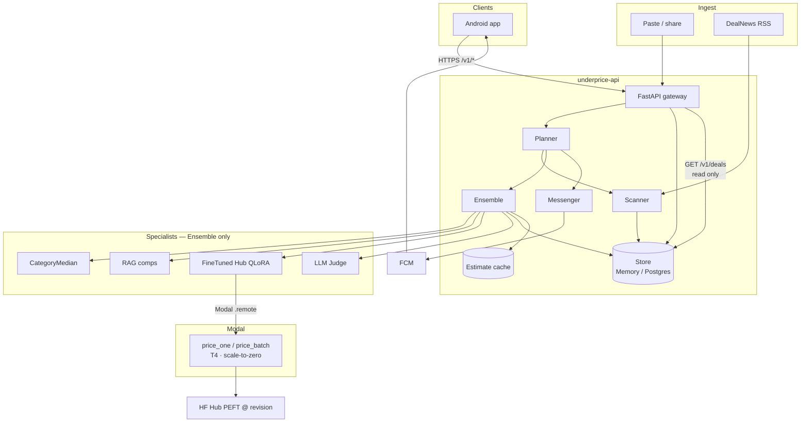
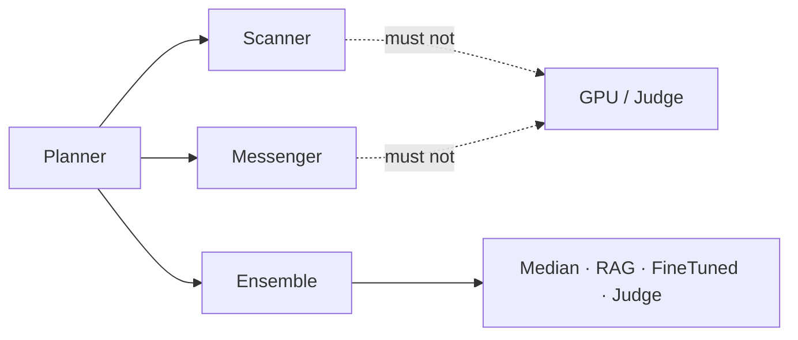
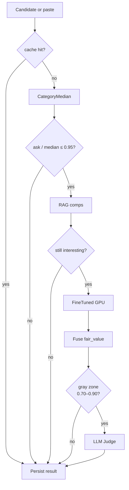
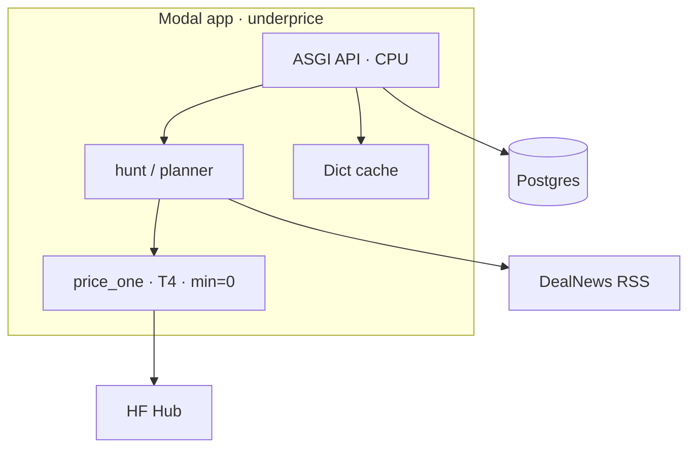

# Architecture

## System context



Two product paths:

| Path | Flow | Latency |
|------|------|---------|
| **Paste** | Android → `POST /v1/score` → Ensemble cascade → maybe GPU | User may wait on T4 cold start |
| **Hunt** | `POST /v1/hunt` / cron → Scanner (DealNews) → Ensemble → Store → Messenger | Feed is precomputed; scroll never hits GPU |

Sibling repos:

| Repo | Owns |
|------|------|
| `price-engine` | Train / eval / `publish-model --tag` → Hub adapter |
| `underprice-api` | Serving, agents, API, ops |
| `underprice-android` | Thin Compose client |

Weights promote by env pin (`ADAPTER_ID` + `REVISION`), not by Android release.

## Design principles

1. **Modular agents + separate specialist deploy units** — never a cheap monolith.
2. Cost control is **ops** (scale-to-zero, cascade gates, batch, cache, rare judge), not deleting modules.
3. **Ensemble is the only specialist orchestrator.** Scanner must not call Judge; Messenger must not call GPU.
4. **Feed is precomputed**; paste is the interactive path that may wait on GPU cold start.
5. Web/CPU image has **no torch**. GPU lives in a separate Modal image/function with **no public HTTP**.

## Agents



| Agent | Responsibility | Must not |
|-------|----------------|----------|
| Planner | Order scan → score → notify; budgets | Price items itself |
| Scanner | DealNews RSS → `Candidate` | Call GPU or Judge |
| Ensemble | Cascade specialists; fuse result | Own push or ingest |
| Messenger | FCM / in-app notify | Call GPU |

## Specialist cascade

```text
estimate(candidate) -> Signal { value: float?, notes: str, source: str }
```



| Gate | Default | Meaning |
|------|---------|---------|
| Median gate | `ask/median <= 0.95` | Else reject without GPU |
| Hot deal | `ask/fair <= 0.70` | Messenger-eligible / feed |
| Gray zone | `0.70–0.90` | Optional Judge |
| Cache TTL | 14 days | Skip specialists |

**Fusion:** prefer FineTuned → RAG → median. `confidence=high` only when FineTuned ran. Always persist `stages_run`, `signals`, `early_exit_reason`.

**Deal score:** `ask / fair_value` (lower is better).

## API rules

- `GET /v1/deals` reads the store only — **never** triggers scoring.
- `POST /v1/score` is rate-limited in production; may return `202` + `job_id` when GPU is cold.
- `POST /v1/hunt` runs Scanner → Ensemble → persists hot deals.
- GPU is invoked only via Modal `.remote()` from the FineTuned specialist.

## Infra (MVP)



| Component | Where | Scale |
|-----------|-------|-------|
| FastAPI | Modal ASGI / local uvicorn | CPU |
| Ensemble + Median | In-process with API | CPU |
| FineTuned | Modal `price_one` / `price_batch` | T4, `min=0` |
| Judge | Provider HTTPS (Phase 5) | No host |
| Store | Memory (default) or Postgres via `DATABASE_URL` | External |
| Cache | In-process + optional Modal Dict (`USE_MODAL_DICT`) | TTL |

## Failure isolation

| Failure | Mitigation |
|---------|------------|
| GPU cold start | Honest client UX; async job poll; cache |
| Specialist error | Signal with `value=None`; cascade can early-exit |
| Cost spike | Median gate, budgets, rate limits, scale-to-zero |
| Bad Hub revision | Pin previous tag; same specialist interface |

## Phase map

| Phase | Deliverable |
|-------|-------------|
| **1** | Paste + Ensemble cascade + FineTuned path + API |
| **2** | Median stats from store samples + shared Modal Dict cache |
| **3 (store + hunt)** | Postgres optional; Scanner pulls DealNews RSS → hunt persists hot deals |
| 3 (notify) | Messenger FCM |
| 4 | RAG comps |
| 5 | Judge on gray/detail |
